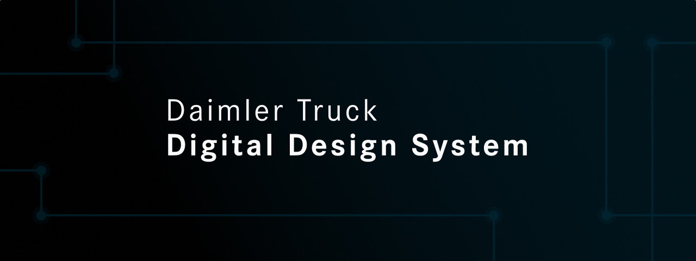

<div align="center">

</div>

<br/>

<div align="center">Component library for Daimler Truck Digital Design System.<br>
It contains UI components, brand themes, examples and documentation.</div>

#

#### **DT-DDS provides:**

- A unified group of utility functions commonly used, and spread across different projects
- A unified group of reusable UI components commonly used, and spread across different projects
- W3C standards, common tooling, and high quality through CI/CD lifecycle
- Accessibility meeting WCAG 2.1 AA standards
- Faster developments and implementations
- Easy collaboration and Maintenance
- Versioning and changelogs
- Documentation

#### **Documentation via:**

- [Storybook/Developer documentation](https://daimlertruck.github.io/DT-DDS/)
- [Figma (private design files)](https://www.figma.com/file/RdxGI4OUcKDRfBRPmBJXbW/DT_UI-Design-System)
- [Confluence (private docs)](https://con.t3.daimlertruck.com/display/DTUI/DT+Design+System+Home)

## 📦 Installation

`@dt-dds/react` uses CSS-IN-JS behind the scenes. You'll also need to add Emotion as a project dependency.

```bash
yarn add @dt-dds/react @emotion/css @emotion/react @emotion/styled
```

### Package Release Status

<!-- PACKAGES_TABLE_START -->
| Package | Version |
|---------|---------|
| [`@dt-dds/react`](https://github.com/daimlertruck/DT-DDS/tree/main/packages/react) | 1.0.0-beta.209 |
| [`@dt-dds/icons`](https://github.com/daimlertruck/DT-DDS/tree/main/packages/icons) | 1.0.0-beta.4 |
| [`@dt-dds/react-accordion`](https://github.com/daimlertruck/DT-DDS/tree/main/packages/react-accordion) | 1.0.0-beta.41 |
| [`@dt-dds/react-avatar`](https://github.com/daimlertruck/DT-DDS/tree/main/packages/react-avatar) | 1.0.0-beta.50 |
| [`@dt-dds/react-backdrop`](https://github.com/daimlertruck/DT-DDS/tree/main/packages/react-backdrop) | 1.0.0-beta.43 |
| [`@dt-dds/react-box`](https://github.com/daimlertruck/DT-DDS/tree/main/packages/react-box) | 1.0.0-beta.10 |
| [`@dt-dds/react-breadcrumb`](https://github.com/daimlertruck/DT-DDS/tree/main/packages/react-breadcrumb) | 1.0.0-beta.51 |
| [`@dt-dds/react-button`](https://github.com/daimlertruck/DT-DDS/tree/main/packages/react-button) | 1.0.0-beta.39 |
| [`@dt-dds/react-card`](https://github.com/daimlertruck/DT-DDS/tree/main/packages/react-card) | 1.0.0-beta.24 |
| [`@dt-dds/react-checkbox`](https://github.com/daimlertruck/DT-DDS/tree/main/packages/react-checkbox) | 1.0.0-beta.40 |
| [`@dt-dds/react-core`](https://github.com/daimlertruck/DT-DDS/tree/main/packages/react-core) | 1.0.0-beta.41 |
| [`@dt-dds/react-date-picker`](https://github.com/daimlertruck/DT-DDS/tree/main/packages/react-date-picker) | 1.0.0-beta.32 |
| [`@dt-dds/react-divider`](https://github.com/daimlertruck/DT-DDS/tree/main/packages/react-divider) | 1.0.0-beta.40 |
| [`@dt-dds/react-drawer`](https://github.com/daimlertruck/DT-DDS/tree/main/packages/react-drawer) | 1.0.0-beta.47 |
| [`@dt-dds/react-dropdown`](https://github.com/daimlertruck/DT-DDS/tree/main/packages/react-dropdown) | 1.0.0-beta.31 |
| [`@dt-dds/react-empty-state`](https://github.com/daimlertruck/DT-DDS/tree/main/packages/react-empty-state) | 1.0.0-beta.59 |
| [`@dt-dds/react-form`](https://github.com/daimlertruck/DT-DDS/tree/main/packages/react-form) | 1.0.0-beta.27 |
| [`@dt-dds/react-icon`](https://github.com/daimlertruck/DT-DDS/tree/main/packages/react-icon) | 1.0.0-beta.42 |
| [`@dt-dds/react-icon-button`](https://github.com/daimlertruck/DT-DDS/tree/main/packages/react-icon-button) | 1.0.0-beta.9 |
| [`@dt-dds/react-label-field`](https://github.com/daimlertruck/DT-DDS/tree/main/packages/react-label-field) | 1.0.0-beta.37 |
| [`@dt-dds/react-link`](https://github.com/daimlertruck/DT-DDS/tree/main/packages/react-link) | 1.0.0-beta.16 |
| [`@dt-dds/react-message`](https://github.com/daimlertruck/DT-DDS/tree/main/packages/react-message) | 1.0.0-beta.55 |
| [`@dt-dds/react-modal`](https://github.com/daimlertruck/DT-DDS/tree/main/packages/react-modal) | 1.0.0-beta.39 |
| [`@dt-dds/react-pagination`](https://github.com/daimlertruck/DT-DDS/tree/main/packages/react-pagination) | 1.0.0-beta.21 |
| [`@dt-dds/react-progress-bar`](https://github.com/daimlertruck/DT-DDS/tree/main/packages/react-progress-bar) | 1.0.0-beta.35 |
| [`@dt-dds/react-radio`](https://github.com/daimlertruck/DT-DDS/tree/main/packages/react-radio) | 1.0.0-beta.26 |
| [`@dt-dds/react-segmented-control`](https://github.com/daimlertruck/DT-DDS/tree/main/packages/react-segmented-control) | 1.0.0-beta.29 |
| [`@dt-dds/react-select`](https://github.com/daimlertruck/DT-DDS/tree/main/packages/react-select) | 1.0.0-beta.46 |
| [`@dt-dds/react-spinner`](https://github.com/daimlertruck/DT-DDS/tree/main/packages/react-spinner) | 1.0.0-beta.44 |
| [`@dt-dds/react-stepper`](https://github.com/daimlertruck/DT-DDS/tree/main/packages/react-stepper) | 1.0.0-beta.31 |
| [`@dt-dds/react-table`](https://github.com/daimlertruck/DT-DDS/tree/main/packages/react-table) | 1.0.0-beta.36 |
| [`@dt-dds/react-tabs`](https://github.com/daimlertruck/DT-DDS/tree/main/packages/react-tabs) | 1.0.0-beta.39 |
| [`@dt-dds/react-tag`](https://github.com/daimlertruck/DT-DDS/tree/main/packages/react-tag) | 1.0.0-beta.43 |
| [`@dt-dds/react-text-area`](https://github.com/daimlertruck/DT-DDS/tree/main/packages/react-text-area) | 1.0.0-beta.23 |
| [`@dt-dds/react-text-field`](https://github.com/daimlertruck/DT-DDS/tree/main/packages/react-text-field) | 1.0.0-beta.49 |
| [`@dt-dds/react-toast`](https://github.com/daimlertruck/DT-DDS/tree/main/packages/react-toast) | 1.0.0-beta.56 |
| [`@dt-dds/react-toggle`](https://github.com/daimlertruck/DT-DDS/tree/main/packages/react-toggle) | 1.0.0-beta.20 |
| [`@dt-dds/react-tooltip`](https://github.com/daimlertruck/DT-DDS/tree/main/packages/react-tooltip) | 1.0.0-beta.49 |
| [`@dt-dds/react-typography`](https://github.com/daimlertruck/DT-DDS/tree/main/packages/react-typography) | 1.0.0-beta.32 |
<!-- PACKAGES_TABLE_END -->

## 🔨 Usage

Import the DT-DDS global styles in the root component.

```tsx
import '@dt-dds/react/index.css';
```

And wrap your code in a `ThemeProvider` component to make it available to all components.

```tsx
import { Provider as ThemeProvider, theme } from '@dt-dds/react';

function App() {
  return <ThemeProvider theme={theme}>
    ...
  <ThemeProvider/>
}
```

We provide a default Daimler Truck theme, available under the package `react-core/themes`

## ⌨️ Development

### Prerequisites

- Node.js >= v18.0.0
- Yarn

### 📓 Installation

- Clone the repo
- `yarn` for package install

### ⚙️ DT-DDS current stack

- [TypeScript](https://www.typescriptlang.org/) for static type checking
- [React](https://reactjs.org/) — JavaScript library for user interfaces
- [Emotion](https://emotion.sh/docs/introduction) — for writing css styles with JavaScript
- [Storybook](https://storybook.js.org/) — UI component environment powered by Vite
- [Jest](https://jestjs.io/) - JavaScript Testing Framework
- [React Testing Library](https://testing-library.com/) - to test UI components in a user-centric way
- [ESLint](https://eslint.org/) for code linting
- [Prettier](https://prettier.io) for code formatting
- [Changesets](https://github.com/changesets/changesets) for managing versioning and changelogs
- [changeset-conventional-commits (forked - custom package)](https://github.com/iamchathu/changeset-conventional-commits) for automatically generating changesets based on conventional commits
- [Tsup](https://github.com/egoist/tsup) — TypeScript bundler powered by esbuild
- [Yarn](https://yarnpkg.com/) from managing packages
- [Turbo-gen](https://turbo.build/repo/docs/core-concepts/monorepos/code-generation#writing-generators)/[Plop](https://plopjs.com/documentation/) for custom generators

#### Useful Commands

- `yarn build` - Build all packages, including the Storybook site
- `yarn dev` - Run all packages locally
- `yarn lint` - Lint all packages
- `yarn clean` - Clean up all `node_modules` and `dist` folders (runs each package's clean script)
- `yarn format` - Format all TypeScript, TypeScript with JSX, and Markdown files based on prettier
- `yarn test` - Run tests for all packages
- `yarn changesets:add` - Generates changesets based on conventional commits
- `yarn changesets:version` - Consumes all changesets, and updates to the most appropriate semver version based on those changesets. It also writes changelog entries for each consumed changeset
- `yarn changesets:tag` - Commits the newly created changelogs with the latest packages version and adds the git-tag as `<package-name>@<package-version>`
- `yarn changesets:ci` - Runs the whole changesets flow, useful for pipelines to generate changesets, versioning and tags
- 🚧 `yarn release` - Build all packages and run npm publish in each package that is of a later version than the one currently listed on npm

### Apps & Packages

This Turborepo includes the following packages and applications:

- `apps/docs`: Developer documentation site, built with Storybook
- `packages/dt-ui-react`: Parent React library
- `packages/react-packages`: React components
- `packages/tsconfig`: Shared `tsconfig.json`s used throughout the Turborepo
- `packages/eslint-config-custom`: ESLint preset
- `packages/jest-config`: Shared jest configuration file
- `packages/changeset-conventional-commits`: Changeset plugin used to automatically generate changesets and tagging versions

### Contributing

See the [contributing guidelines](CONTRIBUTING.md).

### Bug Reports

If you've encountered a bug in our project, please follow these steps to report it:

1. **Search Existing Issues:** Before creating a new issue, please search the [existing issues](https://github.com/daimlertruck/DT-DDS/issues) to check if the bug has already been reported. If you find a similar issue, you can add a comment to provide additional details.

2. **Create a New Issue:** If you couldn't find an existing issue, [create a new issue](https://github.com/daimlertruck/DT-DDS/issues/new/choose) and use the "Bug Report" template. Provide as much detail as possible, including steps to reproduce, expected behavior, and actual behavior. Screenshots, error messages, and relevant code snippets are highly appreciated.

### Feature Requests

To propose a new feature:

1. **Search Existing Requests:** First, search the [existing issues](https://github.com/daimlertruck/DT-DDS/issues) to see if the feature has already been suggested. You can upvote and add your insights to existing feature requests.

2. **Create a New Issue:** If your feature idea hasn't been proposed yet, [create a new issue](https://github.com/daimlertruck/DT-DDS/issues/new/choose) and use the "Feature request" template.

### Issue Etiquette

- Be respectful and considerate when commenting on issues.
- Please **do not** post comments consisting solely of "+1" or ":thumbsup:".
  Use [GitHub's "reactions" feature](https://blog.github.com/2016-03-10-add-reactions-to-pull-requests-issues-and-comments/)
  instead.
- Provide additional information promptly if requested by maintainers.

## &copy; License

Licensed under [MIT License](LICENSE.md)
